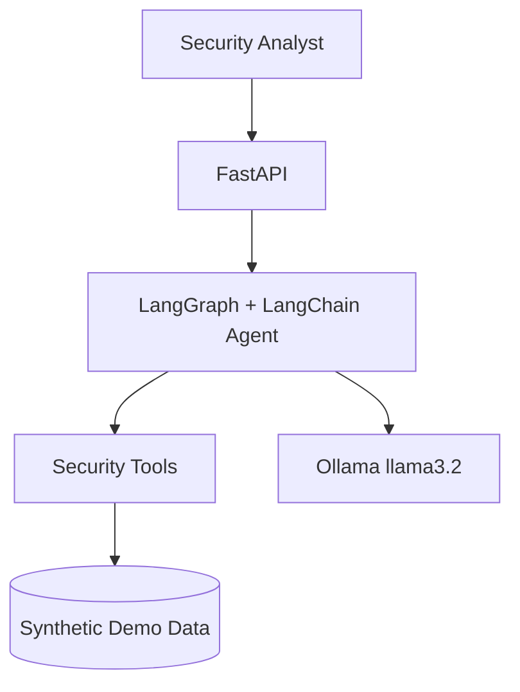

# Threat Intel Graph RAG


> **Part of [Cyber AI Portfolio](https://github.com/manja7304)** — 10 containerized security AI repos.

## Problem

Security teams face backlog and false-positive fatigue in **Threat intel correlation**. This repo demonstrates a production-style **Graph RAG + Hybrid Retrieval** agent using **LangGraph + LangChain**.

STIX/MITRE knowledge graph with hybrid vector+graph retrieval and Streamlit viz.

## Architecture



## Design Patterns

| Pattern | Where Used | Alternative Considered |
|---------|------------|------------------------|
| Graph RAG + Hybrid Retrieval | Core agent flow | Simple prompt chain |
| Tool Calling | Structured security actions | Raw LLM-only answers |
| Ollama-first LLM | `src/llm/factory.py` | Cloud-only APIs |

## Quickstart

```bash
cp .env.example .env
docker compose -f docker/docker-compose.yml up --build
curl -X POST http://localhost:8080/api/v1/agent/run \
  -H "Content-Type: application/json" \
  -d '{"query": "Analyze demo security scenario"}'
```

## Video Demo

[](https://www.youtube.com/watch?v=PLACEHOLDER)

> Record using `demos/RECORDING_SCRIPT.md` and replace PLACEHOLDER with your unlisted YouTube link.

## Evaluation

- Unit tests pass with `USE_MOCK_LLM=true` (no API keys required)
- See `eval/` for RAGAS or agent success metrics where applicable
- Target latency: &lt;5s per query on local Ollama (hardware dependent)

## Security & Ethics

Synthetic demo data only. See [SECURITY.md](SECURITY.md). No unauthorized scanning.

## Documentation

- [Architecture](docs/architecture.md)
- [Design Patterns](docs/design-patterns.md)
- [Demo Data](docs/demo-data.md)
- [Runbook](docs/runbook.md)
