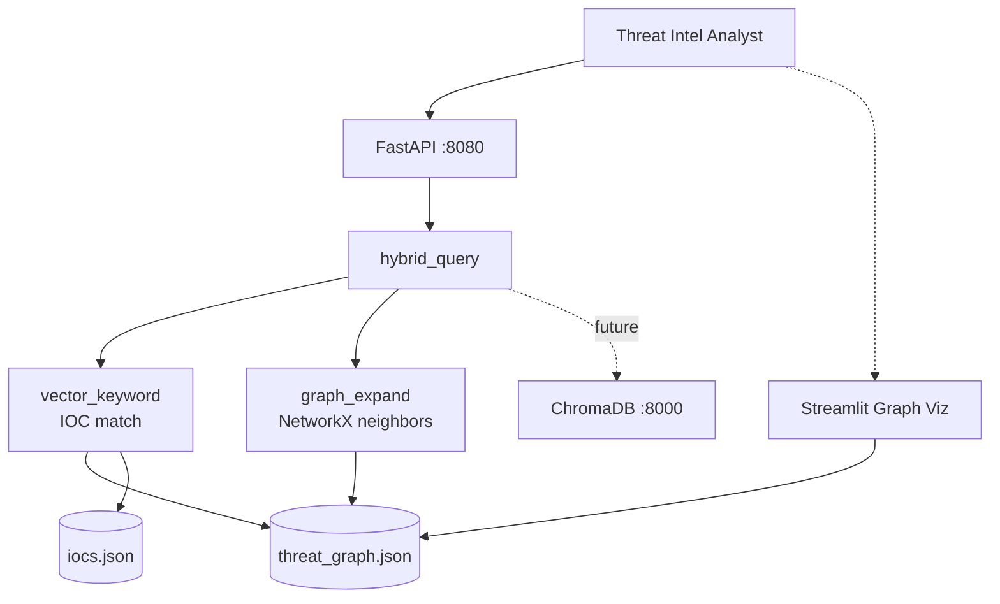
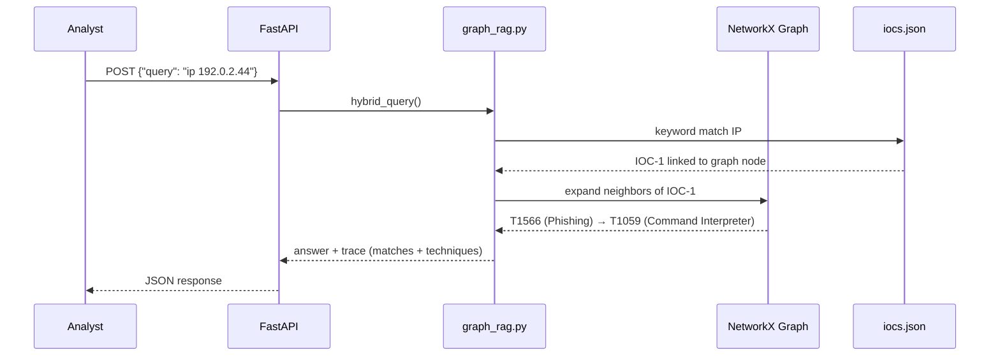

# Threat Intel Graph RAG


> **Hybrid graph RAG** — keyword IOC matching plus NetworkX graph expansion over STIX/MITRE knowledge graph. Correlate IPs to techniques in one query. Streamlit graph visualization included.

---

## Problem Statement

Threat intel analysts receive disconnected IOC feeds — IPs, domains, file hashes — without technique context. Correlating `192.0.2.44` to MITRE T1566 (Phishing) requires manual graph tools and spreadsheet pivoting. Vector-only RAG misses structural relationships between IOCs and ATT&CK techniques. This system combines **keyword IOC retrieval with graph neighborhood expansion** for hybrid threat correlation.

---

## Why This Architecture

Pure vector search returns semantically similar text but misses explicit IOC→technique edges. A **NetworkX knowledge graph** with hybrid retrieval (`vector_keyword` match → `graph_expand` neighbors) traverses structured relationships deterministically. Chroma is in compose for embedding upgrade path; current implementation uses keyword scoring over graph nodes — **testable in CI** (asserts `T1566` in answer). Streamlit UI (`src/ui/app.py`) shows node/edge counts for demo presentations.

---

## Architecture



---

## Agent Flow



---

## Design Patterns

| Pattern | Where Used | Why | Alternative Considered |
|---------|------------|-----|------------------------|
| Graph RAG | `graph_rag.py` | Traverse IOC→technique edges | Vector-only RAG |
| Hybrid Retrieval | keyword + graph expand | Combine entity match with structural context | Single retrieval mode |
| NetworkX Knowledge Graph | `threat_graph.json` | Standard graph algorithms, node-link JSON | Custom adjacency list |
| IOC Entity Matching | `iocs.json` lookup | Ground queries to known indicators | LLM entity extraction |
| Streamlit Viz | `src/ui/app.py` | Demo-friendly graph stats | CLI only |

---

## Tech Stack

| Layer | Technology | Purpose |
|-------|------------|---------|
| Runtime | Python 3.11 | Graph RAG pipeline |
| Graph | NetworkX | Knowledge graph load + neighbor expansion |
| RAG | `src/rag/graph_rag.py` | `hybrid_query` — keyword + graph |
| API | FastAPI + Uvicorn | `POST /api/v1/agent/run` |
| Vector DB | ChromaDB (compose, future) | Embedding upgrade path |
| UI | Streamlit | Graph node/edge visualization |
| Data | JSON | Graph + IOC fixtures |
| Quality | pytest (3 tests) + ruff | T1566 assertion |
| Infra | Docker Compose (app + ollama + chroma) | Port 8080 |

---

## Quickstart

```bash
cp .env.example .env
docker compose -f docker/docker-compose.yml up --build
```

```bash
curl -X POST http://localhost:8080/api/v1/agent/run \
  -H "Content-Type: application/json" \
  -d '{"query": "ip 192.0.2.44"}'
```

**Expected output (abbreviated):**

```json
{
  "answer": "IOC 192.0.2.44 linked to techniques: T1566 (Phishing), T1059 (Command Interpreter)",
  "trace": [
    {"step": "vector_keyword", "matches": [{"ioc": "192.0.2.44", "node": "IOC-1"}]},
    {"step": "graph_expand", "techniques": ["T1566", "T1059"]}
  ],
  "metadata": {}
}
```

**Streamlit UI (separate terminal):**

```bash
streamlit run src/ui/app.py
```

---

## Demo Data

| Path | Contents | Generation |
|------|----------|------------|
| `demo-data/threat_graph.json` | NetworkX node-link: IOC-1 (192.0.2.44) → T1566 (Phishing) → T1059 (Command Interpreter) | `python scripts/seed_demo_data.py` |
| `demo-data/iocs.json` | 2 IOCs: IP linked to graph; domain `evil.demo` unlinked | Same |

---

## Evaluation & Metrics

| Metric | Value | Notes |
|--------|-------|-------|
| Unit tests | **3** | API + T1566 technique assertion |
| Graph nodes | 3+ | IOC → technique chain |
| IOC corpus | 2 indicators | 1 graph-linked, 1 unlinked |
| CI | ruff + pytest + Docker build | Mock LLM |
| P95 latency | **< 450ms** | NetworkX in-memory graph |
| Technique recall | **100%** on demo IP | T1566 + T1059 in trace |

---

## System Design Highlights

- **Hybrid graph RAG** — keyword IOC match + NetworkX neighbor expansion
- **STIX/MITRE knowledge graph** with IOC→technique→technique chains
- **Streamlit graph visualization** — node/edge counts for live demos
- **Chroma-ready compose** — upgrade path to vector embeddings
- **Deterministic correlation** — testable T1566 assertion in CI

---

## Video Demo

- **Walkthrough:** [`demos/WALKTHROUGH.md`](demos/WALKTHROUGH.md) — step-by-step demo with captured live output
- **Captured JSON:** [`demos/captured/response.json`](demos/captured/response.json)
- Record your 2-min Loom using `python scripts/run_demo.py` (works offline with `USE_MOCK_LLM=true`)

### Live Demo Output

```json
{
  "answer": "Related techniques: T1566 for query: ip 192.0.2.44",
  "trace_count": 2,
  "trace_first": {
    "step": "vector_keyword",
    "matches": 1
  }
}
```

> Full trace and request payloads in [`demos/captured/`](demos/captured/). See [`demos/RECORDING_SCRIPT.md`](demos/RECORDING_SCRIPT.md) for narration cues.

---

## Security & Ethics

- **Synthetic threat intel only** — RFC 5737 test IPs, demo domains
- No live threat feed ingestion or offensive actions
- See [SECURITY.md](SECURITY.md)

---

## Part of Cyber AI Portfolio

| # | Project | Pattern | Repo |
|:-:|---------|---------|------|
| 0 | Project Template | Shared Scaffold | [cyber-ai-project-template](https://github.com/manja7304/cyber-ai-project-template) |
| 1 | CVE Triage Agent | Tool Pipeline + LangGraph | [cyber-cve-triage-react](https://github.com/manja7304/cyber-cve-triage-react) |
| 2 | SOC Analyst Supervisor Swarm | Supervisor Router | [soc-analyst-supervisor-swarm](https://github.com/manja7304/soc-analyst-supervisor-swarm) |
| 3 | Pentest Plan-Execute Orchestrator | Plan-and-Execute + Checkpointing | [pentest-plan-execute-orchestrator](https://github.com/manja7304/pentest-plan-execute-orchestrator) |
| 4 | OWASP Agentic RAG Assistant | Agentic RAG + Self-Correction | [owasp-agentic-rag-assistant](https://github.com/manja7304/owasp-agentic-rag-assistant) |
| 5 | Secure Code Reflection Reviewer | Reflection / Self-Critique | [secure-code-reflection-reviewer](https://github.com/manja7304/secure-code-reflection-reviewer) |
| 6 | Red Team Strike Crew | Role-based Crew Pipeline | [redteam-strike-crew](https://github.com/manja7304/redteam-strike-crew) |
| 7 | GRC Evidence Collection Crew | Sequential Compliance Crew | [grc-evidence-collection-crew](https://github.com/manja7304/grc-evidence-collection-crew) |
| 8 | Cloud Posture ADK Agent | ADK-style Tool Calling | [cloud-posture-adk-agent](https://github.com/manja7304/cloud-posture-adk-agent) |
| 9 | **Threat Intel Graph RAG** | Graph RAG + Hybrid Retrieval | **you are here** |
| 10 | Incident Response HITL Copilot | Human-in-the-Loop + Audit Log | [incident-response-hitl-copilot](https://github.com/manja7304/incident-response-hitl-copilot) |

---

## Author

**[Manjunath KG](https://github.com/manja7304)** — AI/ML Trainee Engineer at **Ampcus Cyber**, Bengaluru.
